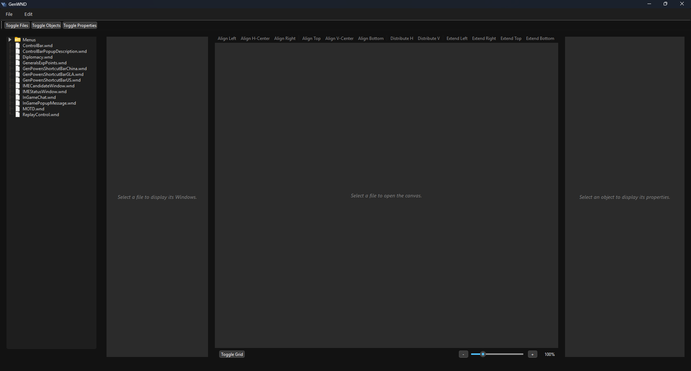
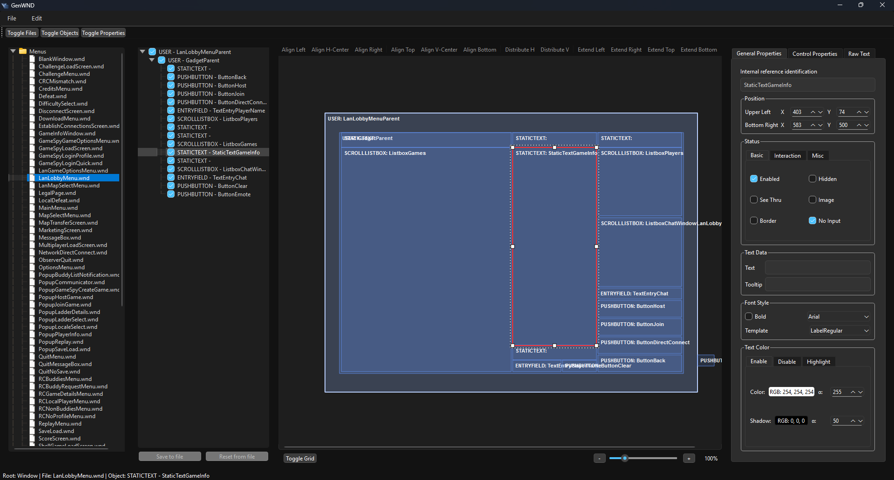
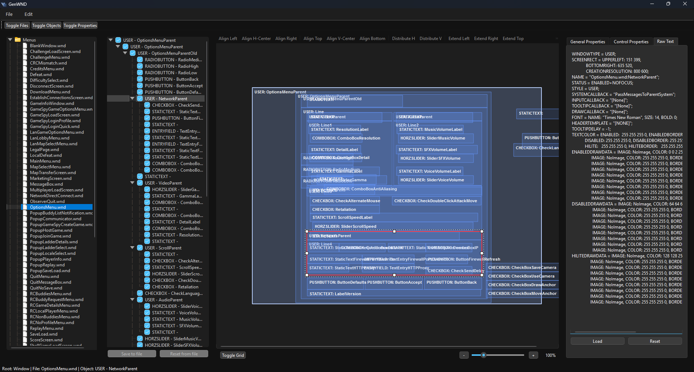

# GenWND - Visual UI Editor for Command & Conquer: Generals – Zero Hour

**GenWND** is an advanced software tool designed to parse, analyze, and visually edit **WND** files, which govern the UI layouts and elements in **Command & Conquer: Generals – Zero Hour**. Built with **Python 3.10** and **PyQt6**, GenWND bridges the gap between raw text configuration files and modern visual editing.

Inspired by the proprietary *WNDEdit* tool developed by deezer, GenWND extends the original functionality by introducing a robust WYSIWYG (What You See Is What You Get) canvas, advanced layout alignment tools, and a reliable Undo/Redo infrastructure.



---

## ✨ Key Features

### 🎨 Interactive Visual Canvas
- **WYSIWYG Editing:** View your UI elements rendered on a visual canvas (`QGraphicsView`).
- **Direct Manipulation:** Select, drag, and resize objects directly on the screen.
- **Smart Navigation:** Use `Ctrl + Mouse Wheel` to zoom seamlessly while maintaining standard scrolling capabilities.
- **Foreground Grid:** Toggleable grid overlay to assist with precise element placement.

### 🌳 Advanced Object Management
- **Hierarchical Object Tree:** Navigate the complex parent-child relationships of WND files with ease.
- **Visibility Toggles:** Quickly hide or show specific elements on the canvas using the "Eye" icon in the object tree.
- **Two-Way Sync:** Changes made in the canvas instantly update the Object Tree and Property Editor, and vice versa.

### ⏪ Fail-Safe Undo/Redo System
- **Command Pattern Architecture:** Every action (move, resize, add, delete) is safely recorded.
- **Macro Operations:** Aligning multiple elements is grouped into a single undoable action, keeping your history clean.
- **Risk-Free Editing:** Make sweeping changes with the confidence that you can always revert them (`Ctrl+Z` / `Ctrl+Y`).

### 📐 Layout & Alignment Tools
- **Alignment Toolbar:** Quickly align selected elements (Centers, Edges, Distribute).
- **Expansion Tools:** Match boundaries and sizes across multiple selected UI components instantly.
- **Live Property Editor:** Fine-tune raw text properties and coordinates manually when pixel-perfect precision is required.

---

## 🏗️ Technical Architecture

GenWND has evolved from a simple parser into a robust Model-View-ViewModel (MVVM) application:

1. **Central Source of Truth:** The parsed WND dictionary acts as the core data model.
2. **Command Pattern (`QUndoCommand`):** All modifications to the data model are handled via isolated command objects, completely decoupling the UI from direct data mutation and preventing memory leaks.
3. **Targeted Rendering (`QGraphicsScene`):** The canvas updates specifically targeted elements via signals, avoiding expensive full-scene redraws and protecting memory states during C++ Garbage Collection.

### Project Structure

```text
GenWND/
├── readme.md
├── logs/
│   ├── log_current.log
│   └── log_current_old.log
├── resources/
│   ├── example.wnd
│   └── styles.qss
├── src/
│   ├── main.py                 # Main Application Window and routing layer
│   ├── object_tree.py          # QTreeWidget managing WND hierarchy and visibility
│   ├── visual_preview.py       # QGraphicsView/Scene managing the interactive Canvas
│   ├── property_editor.py      # Editor for fine-tuning individual window properties
│   ├── file_tree.py            # File navigation
│   ├── commands.py             # QUndoCommand classes (Undo/Redo logic)
│   ├── error_handler.py        # Non-blocking parsing error management
│   ├── log_manager.py          # Log rotation and management
│   └── window/
│       ├── wnd_parser.py       # Core parser for generating the central dictionary
│       ├── window.py           # Window properties object definition
│       └── line_iterator.py    # Line-by-line WND file processing
```

---

## 🛠️ How to Use

### System Requirements
- Python 3.10+
- PyQt6

### Installation

1. Clone the repository:
   ```bash
   git clone [https://github.com/DevGeniusCode/GenWND.git](https://github.com/DevGeniusCode/GenWND.git)
   cd GenWND
   ```

2. Install the required dependencies:
   ```bash
   pip install -r requirements.txt
   ```

### Running the Software
Execute the main entry point to launch the editor:
```bash
python src/main.py
```

---

## 📄 WND File Structure (Internal Representation)

A WND file is a text file containing hierarchical UI settings. When GenWND parses it, it creates an organized Python dictionary structure:

**Raw WND Example:**
```txt
WINDOW
  WINDOWTYPE = USER
  NAME = "MainMenu"
  ...
  CHILD
  WINDOW ; child button
    WINDOWTYPE = BUTTON
    ...
  END
  ENDALLCHILDREN
END
```

**GenWND Parsed Object:**
```python
parser = {
    'file_metadata': {
        'FILE_VERSION': '...',
        'LAYOUTBLOCK': { ... }
    },
    'windows': [
        Window(
            key=uuid1,  # Unique tracker for synchronization
            properties={'WINDOWTYPE': 'USER', 'NAME': 'MainMenu'},
            children=[
                Window(
                    key=uuid2,
                    properties={'WINDOWTYPE': 'BUTTON'},
                    children=[]
                )
            ]
        )
    ]
}
```

---

## 🤝 Contributions
Contributions are welcome! As we prepare for next phase (Game Asset Textures and Text Rendering), we encourage developers to submit Pull Requests or open Issues for bug reports and feature suggestions.

## ⚖️ Licensing
This project is licensed under the **Mozilla Public License 2.0 (MPL-2.0)**. We require all contributors to engage collaboratively while adhering to the **Contributor Covenant** code of conduct.
```
